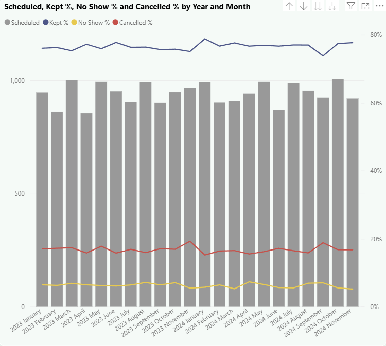

# Healthcare Scheduling (2020–2025): SQL + Power BI

## Executive Summary  
This project analyzes **synthetic healthcare appointment scheduling data** between **2020 and 2025** using **SQL** for data transformation and **Power BI** for visualization. The dataset includes **55,419 scheduled appointments** across **26,606 unique patients**.  

Key findings:  
- Out of 55,419 scheduled appointments, **77.0% were kept**, **16.3% were cancelled**, and **6.0% were no-shows** → cancellations were nearly **3× more common** than no-shows.  
- **Average waiting time was ~45 minutes**, peaking above **60 minutes in May 2022** before stabilizing to ~40–50 minutes.  
- **Day-of-week trends**: Wednesday (77.5% kept, 15.8% cancelled) and Thursday (lowest no-show rate at 5.7%) were the most reliable scheduling days.  
- **Age group differences**: Teenagers (15–19) had the highest kept rate (**78.4%**) and lowest no-show rate (**4.7%**), while adults aged 45–64 had the highest no-show rate (**6.3%**). Seniors (65+) maintained steady attendance (**77.2% kept, 5.9% no-shows**).  

This project demonstrates how SQL and Power BI can work together to uncover **operational inefficiencies**, monitor **attendance patterns**, and provide **actionable insights** for improving healthcare scheduling.  

---

## Business Problem  
Healthcare organizations need to maximize efficiency while ensuring equitable patient access. **Missed appointments** waste resources and reduce availability for other patients. **Long waiting times** reduce patient satisfaction and throughput. Understanding attendance behavior by demographics and scheduling patterns can guide interventions that reduce cancellations and no-shows.  

---

## Methodology  

**SQL (SQLite in VS Code)**  
- Built a **fact_appointment** table combining raw scheduling, slots, and patient data.  
- Used **CASE WHEN logic** to classify appointment outcomes (Kept, Cancelled, NoShow).  
- Derived metrics: waiting time, scheduling interval, patient age groups.  

**Power BI**  
- Developed dashboard:  
  - Calculated DAX Measures (Kept %, NoShow %, Cancelled %, Average Waiting Time)   
  - Field Parameters
  - data visualization
  - data modeling

---
## Results & Business Recommendations  

This dashboard provides healthcare leaders with visibility into **appointment scheduling efficiency, patient attendance, and equity across groups**. By tracking outcomes such as kept %, no-shows, cancellations, and waiting times, decision-makers can identify where capacity is being lost and which groups require targeted interventions.  

🔗 [**Power BI Dashboard**](#) *(https://app.powerbi.com/view?r=eyJrIjoiNTZlMTI0MDktZDA5Zi00ODYzLTgwYjctNjc0MDNhZTFiZDdjIiwidCI6IjQyMGYxZjQxLTJlYjQtNDY1Yi05NDc4LTA0NzI1YTkwNGZiZCJ9)*  

- **Cancellations are the largest driver of lost capacity** (16.3% vs. 6.0% no-shows).  
  → Prioritize flexible rescheduling tools and reminder workflows with quick “confirm/cancel” options.  

- **Day-of-week patterns show reliability midweek** (Wednesdays 77.5% kept, Thursdays lowest no-shows at 5.7%).  
  → Concentrate high-demand scheduling on midweek and add reminder buffers for Fridays.  

- **Waiting times average ~45 minutes, peaking above 60 minutes in April–May.**  
  → Allocate additional resources or telehealth coverage during seasonal spikes.  

- **Age Groups matter**: Teens (15–19) had highest adherence (78.4% kept, 4.7% no-shows), while adults 45–64 had the highest no-show rates (6.3%).  
  → Focus digital nudges and follow-up campaigns that age group.  

- **Insurance performance varies**: Some insurers (e.g., MediNimbus, 73.1% kept, 17.9% cancelled) drive higher cancellations.  
  → Engage insurers with targeted outreach to address gaps.  

---

### Next Steps  
- **AB test** reminder strategies (SMS vs. email) to measure reduction in cancellations.
- **Expand insurer-level analysis** to design equity-driven engagement programs.  
- **Add provider-level performance metrics** to pinpoint efficiency gaps and balance patient load.  

---

## Data Transparency  
This project uses **synthetic data only** — no real patient information is included. Data was generated to mimic realistic appointment scheduling patterns for educational and portfolio purposes. 🔗 [**Source**](#) *(https://www.kaggle.com/datasets/carogonzalezgaltier/medical-appointment-scheduling-system)*  

---
